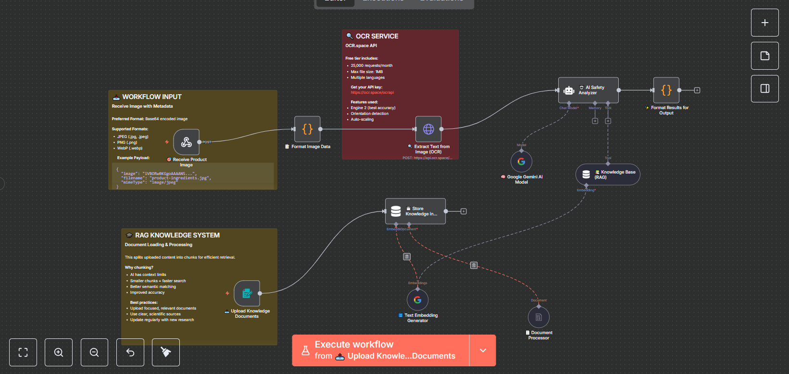

<div align="center">

# 🤖 AI-Powered OCR + RAG Workflow

### *Intelligent Document Processing with n8n Automation*

[](https://n8n.io)
[](https://www.python.org)
[](https://ocr.space)
[](https://ai.google.dev)

---

### 🧠 Transform documents into actionable intelligence with OCR, embeddings, and AI agents

[Overview](#-overview) • [Features](#-features) • [Quick Start](#-quick-start) • [Architecture](#-architecture)  

</div>

---

## 📋 Overview

This repository provides a complete **AI-driven document analysis pipeline** built with **n8n**, **OCR**, and **RAG (Retrieval-Augmented Generation)**.

```mermaid
graph LR
    A[📄 Upload] --> B[🔍 OCR]
    B --> C[🧠 Embeddings]
    C --> D[💾 Vector Store]
    D --> E[🤖 AI Agent]
    E --> F[📊 JSON Output]
<p align="center">  </p>
💡 Ideal for document-to-knowledge pipelines, automated data extraction, and intelligent document analysis.

✨ Features
🔌 Flexible Integration
Accepts images or PDFs via webhook or form

Python and REST API examples available

Works with multiple OCR and vector store providers

🧠 AI-Powered Analysis
OCR text extraction

Embeddings generation for semantic retrieval

RAG-based contextual reasoning using Google Gemini

🔧 Customizable Workflow
Modular n8n nodes

Configurable prompts & LLMs

Plug-and-play vector store integration

🚀 Production Ready
Persistent storage

Secure credentials

Scalable & fault-tolerant

🚀 Quick Start
1️⃣ Import Workflow
Open your n8n instance

Go to Import Workflow

Upload workflow/workflow.json

Review and activate the flow

2️⃣ Configure APIs
OCR.space → API key in HTTP Request node

Google Gemini → Add credentials in n8n

Vector Store → Use Pinecone, Qdrant, or pgvector

3️⃣ Test with Python
bash
Copier le code
pip install requests
python examples/python_example.py
🧩 Repository Structure
bash
Copier le code
n8n-ai-image-analysis-rag/
├── workflow/
│   └── workflow.json           # Main n8n workflow
├── examples/
│   └── python_example.py       # Python integration example
├── assets/
│   └── workflow-screenshot.png # Workflow illustration
├── README.md
└── LICENSE
📊 Architecture
javascript
Copier le code
┌─────────────────────────────────────────────────────────────┐
│                     n8n Workflow Pipeline                   │
├─────────────────────────────────────────────────────────────┤
│ Webhook → OCR Engine → Embedding Generator → Vector Store  │
│                   ↓               ↓              ↓          │
│              RAG Retrieval → AI Agent → JSON Response       │
└─────────────────────────────────────────────────────────────┘
🔐 Best Practices
Store API keys securely in n8n Credentials

Use HTTPS and tokens for webhooks

Avoid logging sensitive data

Regularly rotate API keys

🤝 Contributing
Contributions are welcome!
Feel free to submit pull requests or open issues for suggestions.

📄 License
This project is licensed under the terms specified in the LICENSE file.

<div align="center">
⭐ Star this repo if you find it helpful!
Made with ❤️ for the automation community
Report Bug • Request Feature

</div> ```
