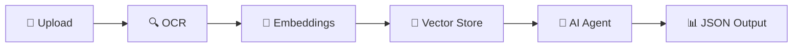

# n8n-ai-image-analysis-rag
AI-powered image analysis workflow using n8n with OCR, RAG, and Google Gemini
=======
<div align="center">

# 🤖 AI-Powered OCR + RAG Workflow

### *Intelligent Document Processing with n8n Automation*

[](https://n8n.io)
[](https://www.python.org)
[](https://ocr.space)
[](https://ai.google.dev)

---

### 🎯 Transform documents into actionable intelligence with OCR, embeddings, and AI agents

[Getting Started](#-quick-start) • [Features](#-features) • [Documentation](#-documentation) • [Examples](#-examples)

</div>

---

## 📋 Overview

This repository contains a powerful **n8n workflow** that seamlessly processes documents through an intelligent pipeline:


<br>

<p align="center">
  
</p>

<br>
**Key Capabilities:**
- ✅ Accept images or PDFs via webhook/form
- ✅ Extract text using advanced OCR
- ✅ Generate embeddings for RAG (Retrieval-Augmented Generation)
- ✅ Query with AI Agent (Gemini/LLM)
- ✅ Return structured JSON responses

> 💡 **Use Case**: Perfect for document-to-knowledge pipelines, automated data extraction, and intelligent document analysis.

---

## 🗂️ Repository Structure

```
your-repo-name/
│
├── 📖 README.md                    # You are here
├── 🔄 workflow/
│   └── workflow.json               # n8n workflow configuration
├── 💻 examples/
│   └── python_example.py           # Sample Python integration
├── 🎨 assets/
│   └── workflow-screenshot.png     # Visual reference
├── 🚫 .gitignore
└── 📜 LICENSE
```

---

## ✨ Features

<table>
<tr>
<td width="50%">

### 🔌 Flexible Integration
- Webhook endpoints
- File upload forms
- Python SDK examples
- RESTful API compatible

</td>
<td width="50%">

### 🧠 AI-Powered
- Advanced OCR processing
- Vector embeddings
- RAG architecture
- LLM agent analysis

</td>
</tr>
<tr>
<td width="50%">

### 🔧 Customizable
- Modular node structure
- Swappable components
- Configurable prompts
- Multiple LLM providers

</td>
<td width="50%">

### 🚀 Production Ready
- Persistent storage options
- Secure credential management
- Error handling
- Scalable architecture

</td>
</tr>
</table>

---

## 🚀 Quick Start

### 1️⃣ Import Workflow

<details>
<summary><b>📥 Click to expand import instructions</b></summary>

1. Open your **n8n instance**
2. Navigate to **Top-right menu** → **Import**
3. Upload or paste `workflow/workflow.json`
4. Inspect the imported nodes
5. Activate the workflow when ready

</details>

### 2️⃣ Configure APIs

<table>
<tr>
<th>Service</th>
<th>Configuration</th>
</tr>
<tr>
<td>

**🔍 OCR.space**

</td>
<td>

1. Get API key from [OCR.space](https://ocr.space)
2. Open HTTP Request node in n8n
3. Set header: `apikey = YOUR_KEY`

</td>
</tr>
<tr>
<td>

**🤖 Google Gemini**

</td>
<td>

1. Obtain API credentials
2. Add credentials in n8n
3. Link to Embeddings & AI Agent nodes

</td>
</tr>
<tr>
<td>

**💾 Vector Store**

</td>
<td>

Choose your provider:
- Pinecone
- Qdrant
- Weaviate
- PostgreSQL pgvector

</td>
</tr>
</table>

### 3️⃣ Run Python Example

```bash
# Install dependencies
pip install requests

# Update webhook URL in examples/python_example.py
# Then run:
python examples/python_example.py
```

---

## 🎯 Key Nodes Overview

| Node | Purpose | Configuration Required |
|------|---------|----------------------|
| 🌐 **Webhook** | Entry point for requests | Copy generated URL |
| 🔍 **HTTP Request (OCR)** | Text extraction | OCR.space API key |
| 🧠 **Embeddings** | Vector generation | LLM credentials |
| 💾 **Vector Store** | Knowledge base | DB connection (prod) |
| 🤖 **AI Agent** | Intelligent analysis | Prompt & schema |

---

## 📚 Documentation

### 📤 Upload Knowledge Documents

The workflow includes a dedicated endpoint for PDF indexing:

1. Access the upload form endpoint
2. Select PDF documents
3. Documents are automatically:
   - Chunked into segments
   - Converted to embeddings
   - Stored in vector database

> ⚠️ **Production Tip**: Configure persistent vector DB before bulk ingestion

### 🔐 Security Best Practices

<table>
<tr>
<td>

✅ **DO**
- Store API keys in n8n Credentials
- Use HTTPS for webhooks
- Implement authentication tokens
- Rotate keys regularly
- Monitor API usage

</td>
<td>

❌ **DON'T**
- Hardcode credentials in nodes
- Expose webhook URLs publicly
- Log sensitive data
- Skip input validation
- Ignore rate limits

</td>
</tr>
</table>

---

## 💻 Examples

### Python Integration

```python
import requests
import base64

WEBHOOK_URL = "https://your-n8n-instance.com/webhook/ocr-rag"

# Read and encode image
with open("document.png", "rb") as f:
    image_data = base64.b64encode(f.read()).decode()

# Send request
response = requests.post(WEBHOOK_URL, json={
    "image": image_data,
    "filename": "document.png",
    "mimeType": "image/png"
})

print(response.json())
```

### Expected Payload Structure

```json
{
  "image": "<base64_encoded_string>",
  "filename": "document.png",
  "mimeType": "image/png"
}
```

---

## 🔧 Troubleshooting

<details>
<summary><b>❌ 400/422 from OCR Service</b></summary>

- Verify base64 encoding is correct
- Check file size (OCR.space limits apply)
- Review rate limits on your API plan
- Ensure MIME type matches actual file

</details>

<details>
<summary><b>🤖 Agent Returns Text Instead of JSON</b></summary>

- Update agent prompt with explicit JSON schema
- Provide example output structure
- Use JSON mode if available in your LLM

</details>

<details>
<summary><b>🔍 RAG Returns No Results</b></summary>

- Confirm same embedding model for index & query
- Verify data persisted to vector store
- Check vector store connection
- Review embedding dimensions match

</details>

<details>
<summary><b>🌐 No Webhook Response</b></summary>

- Ensure workflow is activated
- Verify webhook URL matches exactly
- Check n8n execution logs
- Test with simple payload first

</details>

---

## 🚀 Production Deployment

### Essential Recommendations

| Area | Recommendation |
|------|---------------|
| 💾 **Storage** | Migrate to persistent vector DB (Pinecone/Qdrant/Weaviate) |
| 🔒 **Security** | Enable HTTPS, implement token auth, IP allowlisting |
| 📊 **Monitoring** | Track execution counts, API usage, error rates |
| 💰 **Cost Control** | Set usage limits, monitor LLM token consumption |
| 🔐 **Credentials** | Rotate API keys, use secret management |
| 📝 **Logging** | Filter sensitive data, implement structured logging |

---

## 🎨 Customization Guide

### Modify AI Agent Behavior
```
Edit prompt in AI Agent node → Define custom extraction rules
```

### Swap OCR Provider
```
Replace HTTP Request node → Update API endpoints & auth
```

### Change Vector Database
```
Remove in-memory node → Add persistent provider node → Configure credentials
```

### Adjust Embedding Model
```
Update Embeddings node → Select different model → Test consistency
```

---

## 📊 Architecture Diagram

```
┌─────────────────────────────────────────────────────────────┐
│                     n8n Workflow Pipeline                   │
├─────────────────────────────────────────────────────────────┤
│                                                              │
│  Webhook/Form  →  OCR Engine  →  Text Chunking             │
│       ↓               ↓              ↓                       │
│  Validation    →  Extraction  →  Preprocessing              │
│                                      ↓                       │
│                              Embedding Generator            │
│                                      ↓                       │
│                              Vector Database                │
│                                      ↓                       │
│                              RAG Retrieval                  │
│                                      ↓                       │
│                              AI Agent (LLM)                 │
│                                      ↓                       │
│                              JSON Response                  │
│                                                              │
└─────────────────────────────────────────────────────────────┘
```

---

## 🤝 Contributing

Contributions are welcome! Please feel free to submit a Pull Request.

---

## 📄 License

This project is licensed under the terms specified in the LICENSE file.

---

## 🙏 Acknowledgments

Built with:
- [n8n](https://n8n.io) - Workflow automation
- [OCR.space](https://ocr.space) - OCR processing
- [Google Gemini](https://ai.google.dev) - AI capabilities

---

<div align="center">

### ⭐ Star this repo if you find it helpful!

Made with ❤️ for the automation community

[Report Bug](https://github.com/yourusername/yourrepo/issues) • [Request Feature](https://github.com/yourusername/yourrepo/issues)

</div>
>>>>>>> b85d01e (Initial commit)
